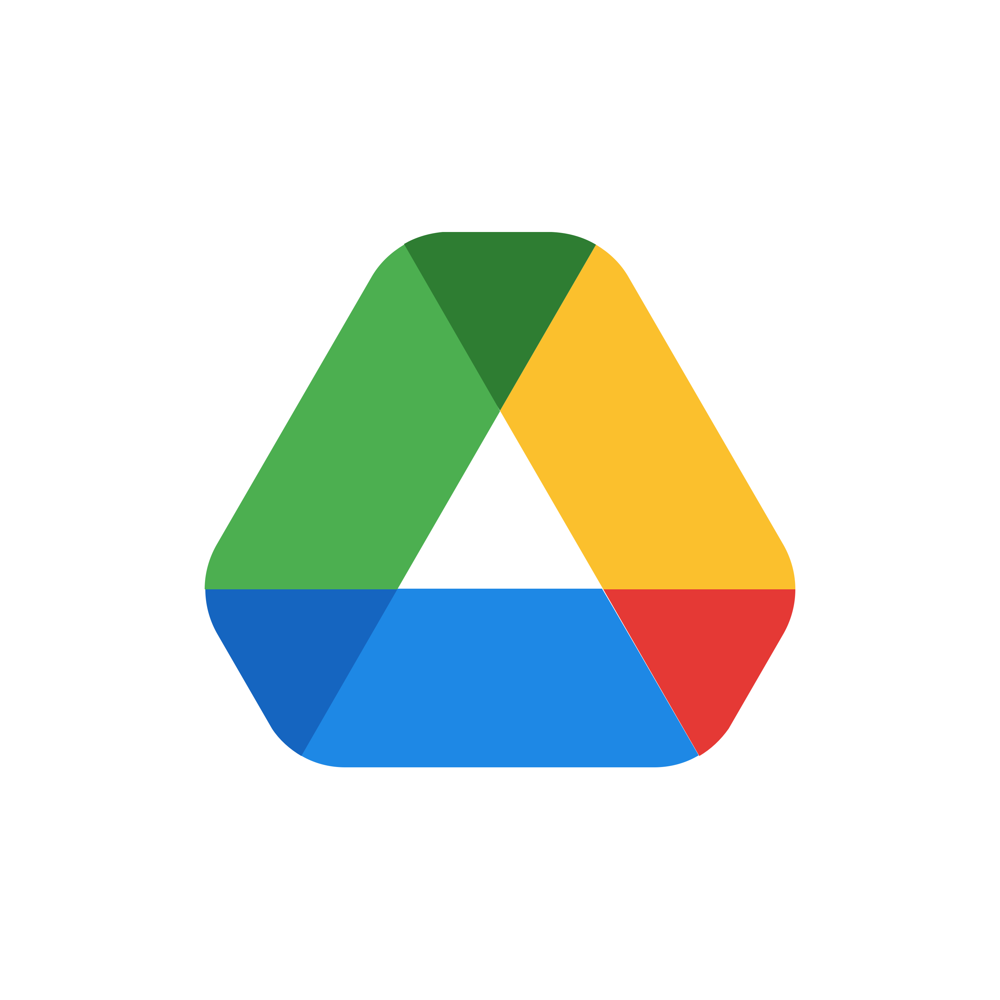

# 2024-2025-Projekt-munka
Egyetemi órarend generáló alkalmazás
## Software developer tools:

 [Google Drive](https://drive.google.com/drive/folders/1GI1A31LWNP_YLqv3hnOa-4M02VlzKX9n?usp=sharing)  
 [Figma](https://www.figma.com/design/iXJbXJHyXxaZxrOFWi23jL/Untitled?t=aQdRlAzcCnlie6Qn-0)  
 [Trello](https://trello.com/b/tAIApkoZ/scrum-board)  
 [Miro](https://miro.com/welcomeonboard/azUyNVVMMU5jQVdVaEtuZlJBRUFmdDVDMUJBcmNycWNsbVp4bm9tNXJaZkRUb05hQm9qYmF6YmtQMmMzWVREa3wzNDU4NzY0NTg1MzMxODU4MTkxfDI/?share_link_id=805881295520)
